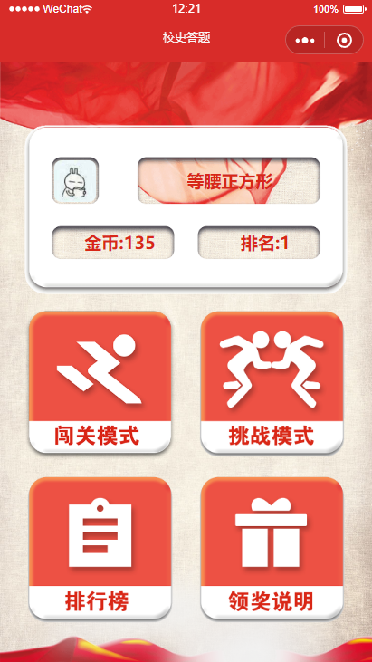
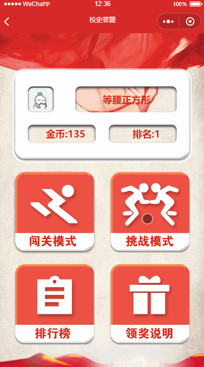
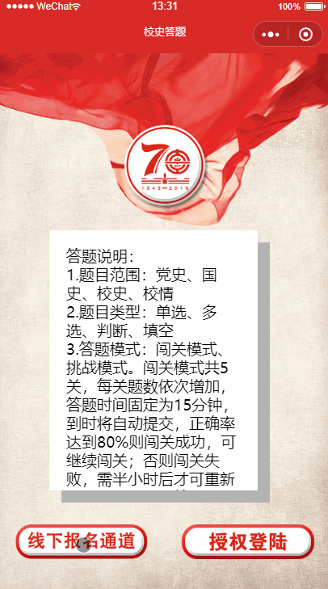

# 大连理工大学 70 周年校庆系列小程序之“校史校情答题竞赛”

# 1. 项目简介

这是于:clock8:2019 年 5 月 30 日由“大连理工大学”官方微信公众号推送的**校庆 70 周年校史校情知识竞赛**小程序，主要功能为线上答题，单选、多选、判断、填空这些基本题型都囊括其中；同时根据学校要求，额外增加了一个线下比赛报名的页面；主要功能页面采用卡片式设计搭配 CSS3 过渡动画，提升了界面的流畅和华丽程度。

# 2. 页面一览

## 2.1. 欢迎页面

一个带参赛规则文本框的欢迎页面，可以从这里进入主页或线下报名通道

## 2.2. 主页

显示用户基本信息和功能菜单

## 2.3. 闯关模式

生成单选、多选、判断、选择等题型，如果答题正确率<80%，将锁定本页面 30min，否则可继续进行下一关

## 2.4. 挑战模式

此模式答对题加金币，答错减金币，奖惩系数随关卡变化；没有冷却时间，但每人每天限 10 次挑战机会，每天 0 点会通过 event_scheduler 进行刷新

## 2.5. 报名页面

提供报名功能，且根据要求在报名前后进行了能否到场的确认环节

## 2.6. 排行榜

显示自己的排名和前 100 名的信息，自己和前三名的序号底色与其他人不同

# 主要功能实现方法
